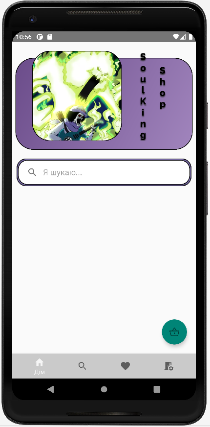
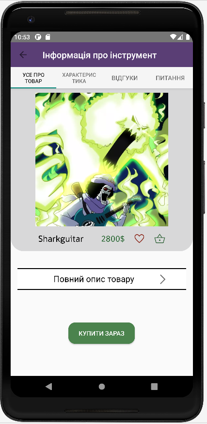
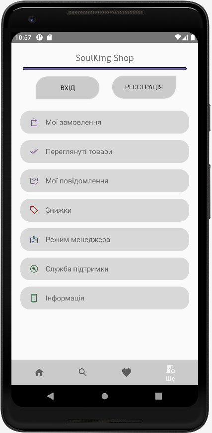

# 🎸 SoulKingShop
## This is an app I'm currently working on and it is about selling musical instruments. 
There are two types of users: managers and clients. Depending on the type a different UI will be displayed.

## 👨‍💻 Tech Stack
* Java
* Android SDK (Debugger, emulator, ADB)

## Prototypes
* [Customer mode](https://www.figma.com/proto/fjr0DbynXCJFBPwtsVyRN4/SoulKing-Shop?node-id=1%3A92&starting-point-node-id=1%3A92)
* [Manager mode](https://www.figma.com/proto/fjr0DbynXCJFBPwtsVyRN4/SoulKing-Shop?node-id=73%3A423&starting-point-node-id=73%3A423)

## 📱 UI
##
* 
* 
*  
